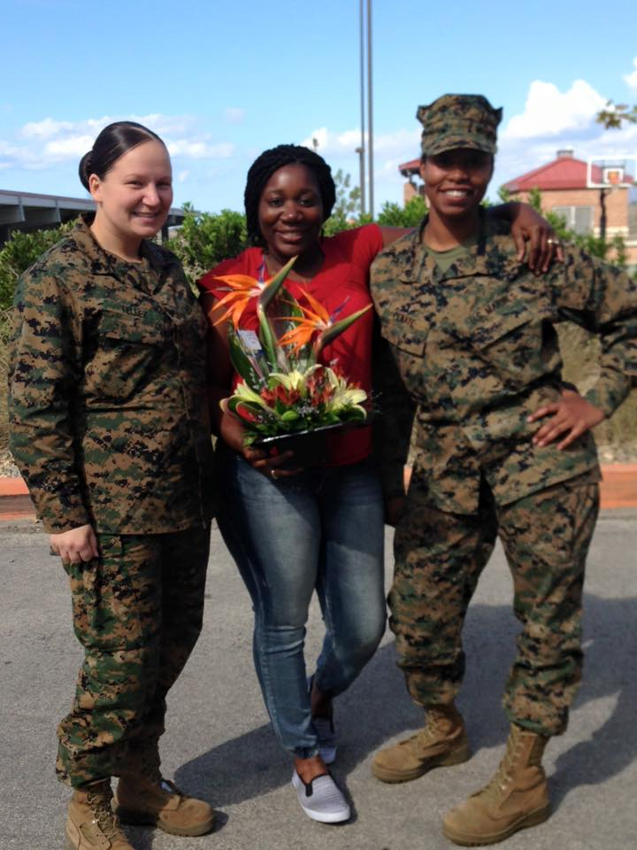

#biography of Sharnaya Penate

#### I was born and raised in Brooklyn New York. Born On March 22. I joined the Marine Corps straight out of high school. I was 18 years old when i joined. I only stayed in the Marines for 4 years. I worked in a supply Warehouse where i issued out a lot of deployment gear and was countable for thousands of dollar worth of gear. I spended 3 whole years there on Camp Pendleton. In 2016 of July i moved to iwakuni Japan. January 2018 I started to go to school at University of Maryland University College, to get my Business degree. I have 3 kids 1 daughter and 2 sons. I am currently married and i have been married for 5 years now. My husband is a SSgt in the Marine Corps.

1. 2011 Graduated for High School
2. 2011 Joined The Marines
3. 2012 Started working at 9th Communications Battalion In Cali
4. 2016 Moved to Iwakuni Japan 
5. 2018 Started school at University of Maryland

[Home](index)
